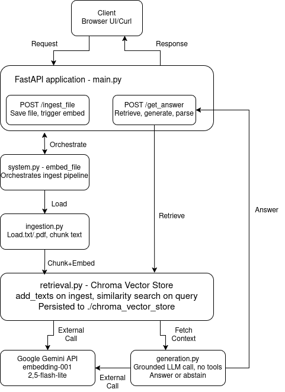

# Sherlock

**A RAG assistant for a detective's case files — answers grounded in the evidence, never guesses.**

Upload `.txt` or `.pdf` case files, then ask questions like *"What was Mrs. Hudson's alibi?"*. Sherlock answers only from what's in the files, cites its sources, and abstains rather than guessing by saying:

"I don't have enough evidence to answer that."

---

## Tech stack

- **Backend:** Python 3.12 + FastAPI, served by uvicorn
- **RAG:** LangChain, Chroma vector store, pypdf
- **Models (free tier):** `gemini-embedding-001` (embeddings), `gemini-2.5-flash-lite` (generation)
- **Frontend:** vanilla HTML, CSS, and JavaScript
- **Infrastructure:** Docker + Docker Compose, with uv for dependency management

---

## Getting started

### 1. Get a free API key

Create one at **[Google AI Studio](https://aistudio.google.com/apikey)** — sign in
with a Google account and click **Create API key**. It's free, no billing required.

### 2. Add the key to a `.env` file

```bash
cp .env_example .env
```

Then open `.env` and paste your key:

```
GEMINI_API_KEY=your-key-here
```

### 3. Run it

```bash
docker compose up --build
```

Open **http://localhost:8080** in your browser and start asking questions.

Uploaded files and embeddings persist between restarts (stored in `./case_files`
and `./chroma_vector_store`).

### Running without Docker

Needs Python 3.12+ and [uv](https://docs.astral.sh/uv/):

```bash
uv sync
uv run uvicorn main:app --app-dir src --port 8080 --reload
```

---

## API endpoints

| Method | Path            | Description                                |
|--------|-----------------|--------------------------------------------|
| GET    | `/`             | Web frontend                               |
| GET    | `/health`       | Health check                               |
| POST   | `/ingest_file`  | Upload a `.txt` or `.pdf` case file        |
| POST   | `/get_answer`   | Ask a question; returns `{answer, sources}`|
| GET    | `/get_files`    | List uploaded case files                   |
| DELETE | `/delete_files` | Delete all files and wipe the vector store |

**Example — ask a question:**

```bash
curl -X POST http://localhost:8080/get_answer \
  -H "Content-Type: application/json" \
  -d '{"question": "What was Mrs. Hudson'\''s alibi?"}'
```

---

## Tests

```bash
uv run pytest                 # offline unit tests (no API key needed)
uv run pytest -m integration  # live tests against the Gemini API (needs a key)
```

Coverage: chunking & loading, source-parsing, endpoint smoke tests, and a grounding suite that checks answerable questions return correct facts and unanswerable ones return the abstention sentence.

---

## How answers stay grounded

Grounding is enforced by the system prompt — Sherlock answers only from retrieved text, cites the files it used, won't name a culprit from motive alone (only a direct statement counts), and abstains when the answer isn't there. Gemini's safety filters are set to `BLOCK_NONE` so it can discuss crime details; grounding comes from the prompt, not the filter.

---

## Architecture & Data Flow



---

## Further reading

Full write-up on architecture, grounding strategy, and design trade-offs: [`docs/report.pdf`](docs/report.pdf).
